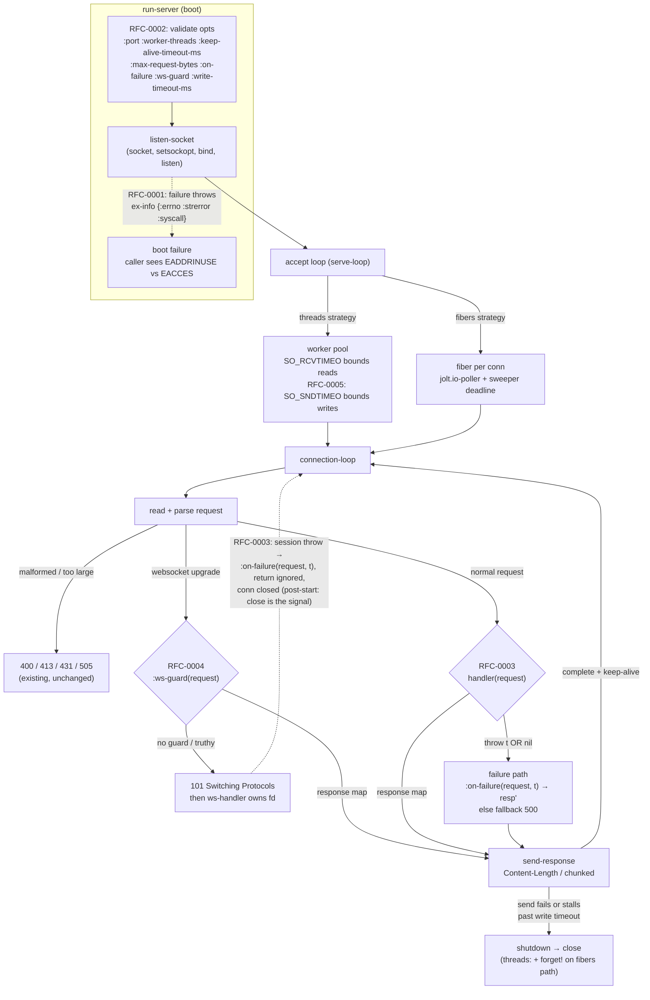

# RFC-0000: Error-handling adoption roadmap (swish + Igropyr)

- Status: Accepted
- Supersedes: nothing (extends the completed PLAN.md phases 1–6)
- Source survey: swish (`/Users/yogthos/src/swish`), Igropyr (`/Users/yogthos/src/Igropyr`), Aug 2026

## Summary

Adopt the error-handling patterns from two Chez Scheme web stacks into the
adapter, as five independently deliverable phases, each specified by its own
RFC and built test-first:

- Phase 1 / RFC-0001 — errno-enriched FFI errors (swish)
- Phase 2 / RFC-0002 — boot-time option validation (Igropyr)
- Phase 3 / RFC-0003 — unified request failure path: `:on-failure` hook +
  nil-response → 500 (Igropyr + Ring spec)
- Phase 4 / RFC-0004 — websocket upgrade guard (Igropyr `ws-reject`)
- Phase 5 / RFC-0005 — write timeout on server sends (Igropyr
  `write-timeout-ms`, covering swish's short-timeout error-write insight)

## Pattern inventory (survey result)

Adopted:

- **errno in every FFI failure** (swish `errors.ss`): all syscall failures
  carry errno + strerror text; swish renders ~130 tagged reasons through one
  `exit-reason->english`, and `errno->english` is `strerror`. Our equivalent:
  `ex-info` with structured ex-data — Jolt's native error mechanism.
- **`:on-failure` hook** (Igropyr `http.sc` ~1230, ~1904): a user callback
  invoked when a handler task fails; it answers through the *normal* response
  path so keep-alive survives; exceptions inside the hook are caught and fall
  back to the plain 500.
- **Boot-time validation** (Igropyr `http.sc` ~1895): a bad numeric option
  must crash at boot — "deferred to request time it raises inside the reader
  and the connection just drops."
- **`ws-reject`** (Igropyr `http.sc` ~1610): an auth guard can refuse an
  upgrade *before* the 101/handshake — "an unauthenticated peer never gets
  the socket."
- **Write timeout** (Igropyr `default-write-timeout-ms 30000`): a peer whose
  receive window stays shut must not park a worker forever; swish applies the
  same idea to the error write itself (100ms short timeout, `http.ss` ~403).

Considered, not adopted (with reasons — see "Non-adopted patterns"):

- stale-task skip (no gap in our architecture: parse and handler-run share
  one loop iteration; a conn that dies while queued EOFs at first read
  without ever invoking the handler)
- post-start-crash → close for channel bodies (not expressible in the Ring
  channel contract — see RFC-0003 §Drawbacks)
- 404 default for "handler ran but never responded" (we follow Ring/Jetty:
  nil → 500)
- `limit-stack` on user handlers (Chez continuation-stack specific; our
  handlers run on OS threads)
- monitor-not-guard producer watcher (Igropyr green-process supervision;
  core.async channels already give us producer shutdown)
- `current-exit-reason->english` extension parameter (we are a library, not
  an app framework: ex-data is the extension point)

## Fig 1 — Architecture and data flow with adoption points

Solid arrows are request/data flow; dotted arrows are the adoption points
(RFC numbers label each).



## Fig 2 — Error-handling flow (target state after phase 3)

```mermaid
flowchart TD
    subgraph BOOTERR["Boot errors"]
        B1["listen-socket syscall fails"] --> B2["ex-info\n{:syscall bind :errno 98 :strerror \"Address already in use\"}"]
        B3["bad :port / :worker-threads / ..."] --> B4["ex-info\n{:key :port :given \"abc\" :expected \"int 1..65535\"}"]
    end

    subgraph REQERR["Per-request errors"]
        H1["handler throws t"] --> FP
        H2["handler returns nil\n(Ring: 500, not close)"] --> N1["wrap as ex-info\n{:type :ring-chez/nil-response}"] --> FP
        FP{"failure path"} --> OF{":on-failure\nconfigured?"}
        OF -->|"no"| F500["fallback 500\nplain text, bounded write"]
        OF -->|"yes"| CALL["(on-failure request t)\nhook errors caught → nil"]
        CALL -->|"response map resp'"| SEND["send resp'\nnormal path — keep-alive preserved"]
        CALL -->|"nil / threw"| F500
        F500 --> SEND2["send 500\nnormal path — keep-alive preserved"]
    end

    subgraph WSERR["Websocket errors"]
        G1[":ws-guard returns response map"] --> SEND3["send it before 101\nunauthenticated peer never gets the socket"]
        S1["ws-handler throws after 101"] --> OFW{":on-failure?"}
        OFW -->|"yes"| LW["(on-failure request t)\nreturn value IGNORED"]
        OFW -->|"no"| CW["close conn"]
        LW --> CW
    end
```

## Phase table

- Phase 1 — RFC-0001 errno errors — touches `listen-socket` only; no public
  API change; deliverable: structured boot failures.
- Phase 2 — RFC-0002 boot validation — touches `run-server` front; deliverable:
  bad opts crash at boot with actionable ex-data.
- Phase 3 — RFC-0003 failure path — adds `:on-failure`, nil→500, groups the
  growing positional args into a per-server config map (internal refactor);
  deliverable: observable + customizable request failures.
- Phase 4 — RFC-0004 ws upgrade guard — adds `:ws-guard`; deliverable:
  pre-handshake upgrade refusal.
- Phase 5 — RFC-0005 write timeout — adds `:write-timeout-ms` (threads
  strategy; documented fibers caveat); deliverable: stalled peers cannot pin
  workers.

Each phase: failing test → minimal implementation → full suite
(`jolt -M:test`) green → commit. Dependencies: 3 uses 1's ex-data
conventions and 2's validator slot; 4 uses 3's config map; 5 extends 2's
validator. 1 and 2 are order-independent.

## Non-adopted patterns

- **Stale-task skip** (Igropyr `http.sc` ~1248: check `conn-state` before
  running the handler). Igropyr decouples parsing (reader process) from
  handler execution (pool worker queue), so a task can sit in a queue for a
  gone client. Our adapter parses and invokes the handler in the same
  `connection-loop` iteration; a connection that dies while queued for a
  worker EOFs at its first read and the handler is never invoked. There is
  no window to close.
- **Post-start crash → close for streamed bodies** (Igropyr ~1276). For a
  core.async channel body, a producer that closes the channel early is
  indistinguishable from one that finished — both deliver `nil` on take. The
  Ring channel contract has no abort signal, so we cannot suppress the
  terminating `0\r\n\r\n` chunk for aborted producers without breaking
  well-formed producers. Our write-failure path (client gone mid-stream)
  already closes without the terminator, which is the truncation signal
  Igropyr relies on.
- **404 for "ran but never responded"** (Igropyr framework default). We are a
  Ring adapter; Ring/Jetty answers nil with 500. Follow the Ring spec.
- **`limit-stack`** (swish `http.ss` ~1093). Caps Chez continuation stack for
  user handlers. Our handlers run on OS threads (or `:run!` threads) with
  ordinary thread stacks; not applicable.
- **monitor-not-guard producer watcher** (Igropyr ~1318). Depends on
  Igropyr's process supervision; core.async channel close already unblocks
  our streaming pumps on teardown.
- **Extensible error renderer** (swish `current-exit-reason->english`
  parameter). Swish is an application framework; we are a library. The
  extension point is `ex-data` + `:on-failure` — user code formats what it
  wants.
