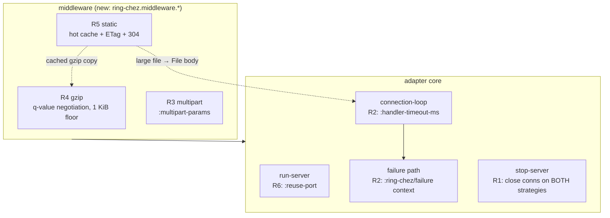

# RFC-0007: second adoption wave (Igropyr) — liveness, uploads, gzip, static

- Status: Accepted
- Extends: RFC-0000 (first wave, phases 1–5, all landed)
- Source survey: Igropyr (`/Users/yogthos/src/Igropyr`), Aug 2026

## Summary

The first wave took Igropyr's *error reporting* — errno-enriched boot
failures, boot-time validation, `:on-failure`, `:ws-guard`, write timeout.
What it did not take is Igropyr's *liveness* half (a request that never
finishes must still end) and the parts of the framework layer that a Ring
stack on jolt cannot get from ring-core, because ring-core reaches for the
JVM to provide them.

Six rounds, each its own RFC, its own PR, test-first:

- Round 1 / RFC-0008 — `stop-server` actually stops (bug)
- Round 2 / RFC-0009 — handler deadline + failure context (`stuck-ms`)
- Round 3 / RFC-0010 — multipart uploads (`wrap-multipart-params`)
- Round 4 / RFC-0011 — gzip middleware (zlib via `jolt.ffi`)
- Round 5 / RFC-0012 — static file middleware (hot cache, ETag, 304)
- Round 6 / RFC-0013 — `:reuse-port`, trusted-proxy `:remote-addr`

TLS (Igropyr `tls.sc`, OpenSSL as a byte codec) is tracked but out of this
wave: it is a project, not a round.

## Why these

Ring's own middleware covers CORS, sessions, cookies, security headers and
rate limiting in pure Clojure, and those run on jolt unchanged — nothing to
adopt. Three things it cannot cover, because the JVM was assumed:

| need | ring-core's answer | why it fails on jolt |
| --- | --- | --- |
| uploads | `wrap-multipart-params` | Apache commons-fileupload |
| compression | (none in core; `ring-gzip` and friends) | `java.util.zip` |
| static caching | `wrap-file` re-stats and re-opens per request | works, but no cache |

Measured, not assumed: `java.util.zip.GZIPOutputStream` is absent under
jolt v0.7.19; `libz` loads through `jolt.ffi/load-library` (zlib 1.2.12) —
which is exactly how Igropyr does gzip, so the port is a port and not a
redesign. `java.io.File` is present and complete enough for static serving
(`.getCanonicalPath` resolves symlinks), so Round 5 is a caching layer over
what already works rather than a reimplementation.

## Fig 1 — where each round lands

## Round table

- **Round 1 — RFC-0008 — `stop-server` (bug).** Verified: on `:threads` a
  keep-alive connection opened before the stop is still served after
  `stop-server` returns, and its worker lingers up to
  `:keep-alive-timeout-ms`. On `:fibers` every connection is closed. One
  call, two meanings. Touches `stop-server` + `connection-loop`.
- **Round 2 — RFC-0009 — handler deadline.** Igropyr `stuck-ms` (30 s,
  supervisor kills the worker and answers through `on-failure` with
  `kind=stuck`). Nothing bounds handler execution here: on `:threads` a
  hung handler holds its worker forever and the pool dies one request at a
  time; on `:fibers` it is quieter and worse — `connection-loop` suspends
  the sweeper deadline before invoking the handler, so the fd, the fiber
  and the `async/thread` thread all leak with no bound. Adds
  `:handler-timeout-ms` (default 60000) and `:ring-chez/failure` context
  on the request handed to `:on-failure`, plus `ring-chez.fault` —
  Igropyr's `make-fault-handler` in Ring form.
- **Round 3 — RFC-0010 — multipart.** `jolt-lang/multipart` (RFC 7578,
  already written) proved end-to-end through the adapter, then wrapped as
  `ring-chez.middleware.multipart/wrap-multipart-params` so the Ring shape
  (`:multipart-params`, merged into `:params`) is a require away.
- **Round 4 — RFC-0011 — gzip.** `ring-chez.middleware.gzip/wrap-gzip`,
  zlib bound lazily through `jolt.ffi` — absent libz degrades to "send it
  uncompressed", which is Igropyr's own fallback. Ports its negotiation
  verbatim: `gzip;q=0` means no, `*;q=0, gzip` means yes, 1 KiB floor,
  compressible-type prefixes, `Vary: Accept-Encoding`.
- **Round 5 — RFC-0012 — static.** `ring-chez.middleware.static/wrap-static`:
  hot files answered from an in-memory cache (hashtable lookup, mtime
  re-checked at most once a second), ETag + `If-None-Match` → 304, files
  over the cache cap handed to the adapter as a `File` body (already
  streamed with backpressure), gzip'd copies cached beside the plain ones,
  dotfiles refused and the root escaped by nothing.
- **Round 6 — RFC-0013 — ops.** `:reuse-port` (one `setsockopt`; N
  processes share a port, kernel-balanced) and trusted-proxy
  `:remote-addr` — Igropyr takes the Nth `X-Forwarded-For` entry *from the
  right* per a declared hop count, because everything left of that is
  written by the client.

## Not adopted (and why)

- **`max-retries` / crash-retry ring.** Igropyr re-runs a failed task up to
  3 times. A Ring handler is not required to be idempotent and has no
  "answered yet?" token to gate on — re-running one that already wrote to
  a database is worse than a 500. The `:on-failure` hook already gives the
  client a fault it can resubmit against, which is the half of the retry
  ring that is ours to offer.
- **Conversations, green processes, `res-spawn!` watchers.** Not
  expressible over Ring's request/response contract.
- **The express layer** (routing, `app-use`, `send-json!`). Ring has
  routers; this is an adapter.
- **CORS / security headers / sessions / rate limiting.** Pure-Clojure Ring
  middleware exists and runs on jolt today.
