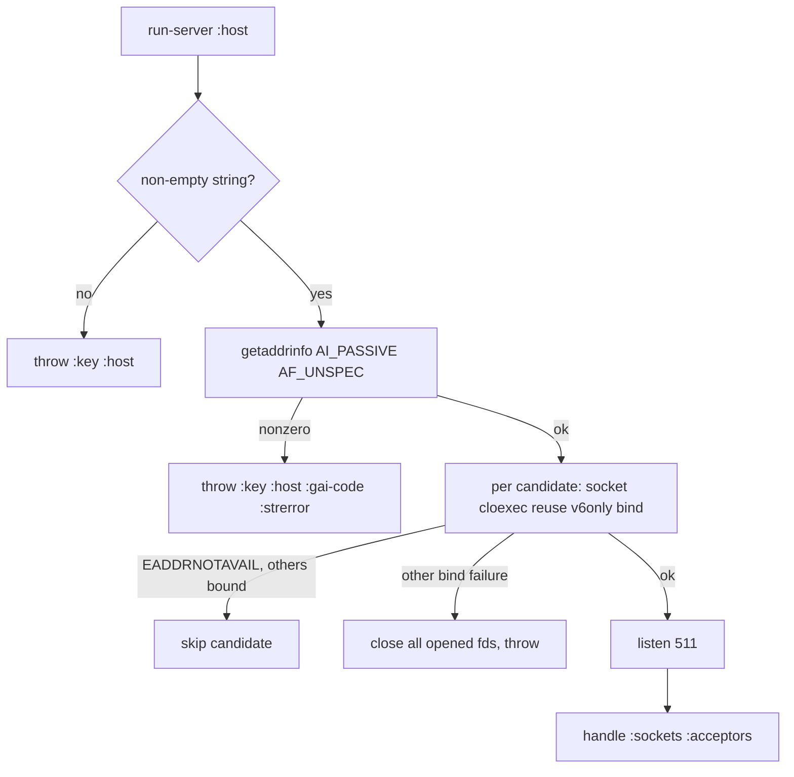

# RFC-0016: hostname and IPv6 bind (`:host`)

- Status: Accepted (branch `ipv6-hostname`)

## Summary

`:host` today accepts an IPv4 dotted quad and nothing else — `make-sockaddr`
runs it through `inet_pton AF_INET` and throws otherwise, so `"::1"` and
`"localhost"` are rejected at boot. This RFC widens `:host` to three accepted
forms:

- an IPv4 literal (`"127.0.0.1"`, `"0.0.0.0"`) — as today;
- an IPv6 literal (`"::1"`, `"::"`, `"fe80::1"`), bound on its own
  `AF_INET6` socket;
- a hostname (`"localhost"`, `"example.internal"`), resolved once at boot
  with `getaddrinfo`; **every** `AF_INET`/`AF_INET6` answer is bound, so
  `"localhost"` serves both `::1` and `127.0.0.1` on the same port.

The default stays `"127.0.0.1"`. Resolution is not `gethostbyname` (IPv4-only,
what jolt's own `jolt.socket` uses) but `getaddrinfo` — the POSIX replacement,
family-agnostic, and the same resolver every other server uses.

## Motivation

A hostname or an IPv6 address in `:host` is rejected with "must be an IPv4
address", which is the whole of IPv6 broken in one message: a box that is
v6-only cannot be served, a dual-stack box cannot be asked for both families,
and deployment configs that name the interface (`:host "localhost"`, a
service name from `/etc/hosts`, a Docker DNS name) cannot be expressed.

## Design

### Resolution: one path for all three forms

`getaddrinfo` parses numeric literals itself (no DNS) and resolves names, so
one call covers every form. Hints: `AI_PASSIVE`, family `AF_UNSPEC`, socktype
`SOCK_STREAM`. The returned `ai_addr` chain is walked (the `struct addrinfo`
layout is identical on macOS and Linux: `ai_flags/ai_family/ai_socktype/
ai_protocol` as ints at 0/4/8/12, `ai_addrlen` at 16, pointers at 24/32/40),
each `AF_INET`/`AF_INET6` entry's sockaddr is **copied** into our own buffer
with the port written in at bytes 2-3 (family-agnostic: that offset holds
`sin_port`/`sin6_port` in both structs), and `freeaddrinfo` releases the
chain. macOS `sin_len` bytes come along in the copy — the buffer is
bind-ready exactly as getaddrinfo shaped it.

`bind-sockaddrs` returns `[{:family AF_INET|AF_INET6 :addr buf :addrlen n}]`
in resolver order (RFC 6724 — v6 first typically), or throws `ex-info` with
`:key :host`, `:given`, `:gai-code`, `:strerror` from `gai_strerror`
(getaddrinfo codes are NOT errno: `EAI_NONAME` is 8 on macOS and -2 on Linux,
so no errno-switching anywhere).

### Bind-all with skip/abort policy

`listen-sockets` (plural) maps the resolved list through the existing
per-socket sequence — `socket()`, `FD_CLOEXEC`, `SO_REUSEADDR`, optional
`SO_REUSEPORT`, `bind()`, `listen(511)` — collecting fds:

- `EADDRNOTAVAIL` on one candidate is **skipped** (address family absent on
  this box: `::1` with v6 disabled) as long as another candidate bound. It is
  the only skipped errno: if it is the only candidate, it throws, so
  `:host "::1"` on a v6-less box still fails loudly.
- any other bind failure (`EADDRINUSE` above all) closes every fd opened so
  far and throws — the friendly EADDRINUSE message survives. A half-bound
  server (v6 up, v4 not) is never returned, because "port already in use" is
  how you find out a server is already running.

### IPv6-only, explicitly

Every `AF_INET6` listener sets `IPV6_V6ONLY=1` (level `IPPROTO_IPV6`; option
27 on macOS/BSD, 26 on Linux). Without it, binding `"::"` silently accepts
v4-mapped connections on Linux (`bindv6only=0` default) but not everywhere —
platform state deciding what a config line means. With it, a bound address
serves exactly its family, and dual-stack comes from a name that resolves to
both (`"localhost"`), which is explicit in the config.

### Accept path: `sockaddr_storage` + `inet_ntop`

`alloc-peer-sockaddr` grows to a 128-byte `sockaddr_storage` (salen 128) so
`accept()` fills either family. `peer-ip` reads the family first (byte 1 on
macOS, the little-endian u16 at 0 on Linux) and formats through `inet_ntop`
(RFC 5952 compression comes free): 4 bytes at offset 4 for v4, 16 bytes at
offset 8 for v6. `:remote-addr` then reads `"::1"` for a v6 peer. One
cosmetic limit, documented: a link-local peer prints without its zone
(`"fe80::1"`, not `"fe80::1%en0"`) — `inet_ntop` does not know scopes.

### One accept loop per fd, teardown per fd

`serve-loop` is unchanged and runs once per listen fd (a `mapv` of futures);
they share `serve!`, the conn registry, the pool and stats, and each keeps
its own sockaddr bufs and backoff. The handle carries `:sockets` (vector)
and `:acceptors`; `:socket`/`:acceptor` remain the first of each for
back-compat (the cloexec test reads `:socket`).

`stop-server` runs the existing unblock sequence — `shutdown(SHUT_RDWR)` then
`dup2(/dev/null)` — over **every** fd first (so all parked accepts fail at
once), then waits each acceptor with the drain timeout and closes each fd
under the same exited/reserved rule as today.

### Port 0 with several sockets

The kernel picks an independent port per bind, so `:port 0` + two families
would hand back two ports. `listen-sockets` binds the first candidate with
port 0, reads the chosen port back with `getsockname`, and binds the rest
with that explicit port — one port for the whole server, as the handle's
`:port` promises. If the chosen port is busy on the other family, the
abort-all policy throws with the EADDRINUSE message.

### Validation

`validate-opts!`'s `:host` check shrinks to "a non-empty string": literal
validity and resolvability are both the resolver's call, made at boot inside
`run-server` — an unresolvable name throws before any resource is held, with
`:key :host` in the ex-data, same as today's shape.

## Error flow

## Test plan

Socket layer (new tests beside `test-bind-host-option`):

- `bind-sockaddrs` on `"127.0.0.1"` / `"::1"` / `"localhost"` / garbage —
  family, addrlen (16/28), both families for localhost when the box has v6,
  throw shape for `.invalid` names.
- `listen-sockets "localhost" 0` — every fd the same port, cloexec set.
- `peer-ip` on a hand-built `sockaddr_in6` — `"::1"` round-trip.

Adapter:

- `:host "::1"` serves; `:remote-addr` reads `"::1"` (raw v6 client — the
  test helper's `client-connect` gains a host arg).
- `:host "localhost"` — both families answer on the one port.
- EADDRINUSE across families: server on `127.0.0.1:P`, second server on
  `"localhost"` P aborts with the friendly message (no half-bound server).
- `stop-server` closes both listeners.
- rejected forms `""`, `42`, `"no.such.host.invalid"` throw naming `:host`.

## Documentation

README `:host` entry and the `run-server` docstring list the three accepted
forms, the bind-all-answers rule, `IPV6_V6ONLY` (bind `"::"` = v6 only), and
the port-0 unification. No deps.edn change: `getaddrinfo`, `freeaddrinfo`,
`gai_strerror`, `inet_ntop` are libc symbols already covered by the
`:process` native declaration.
